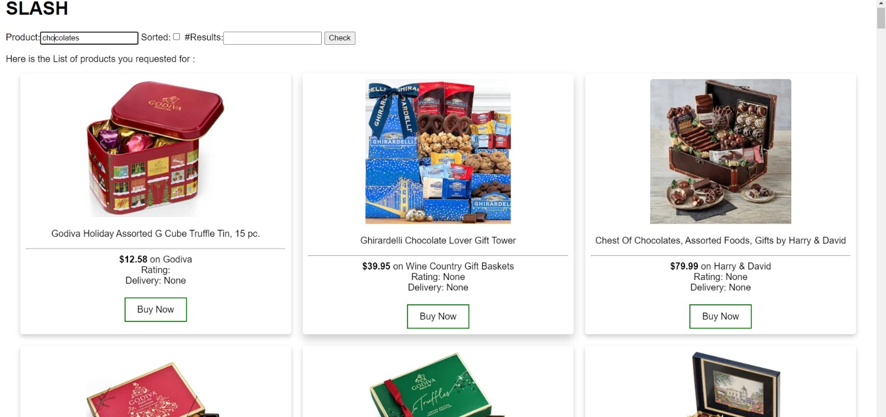
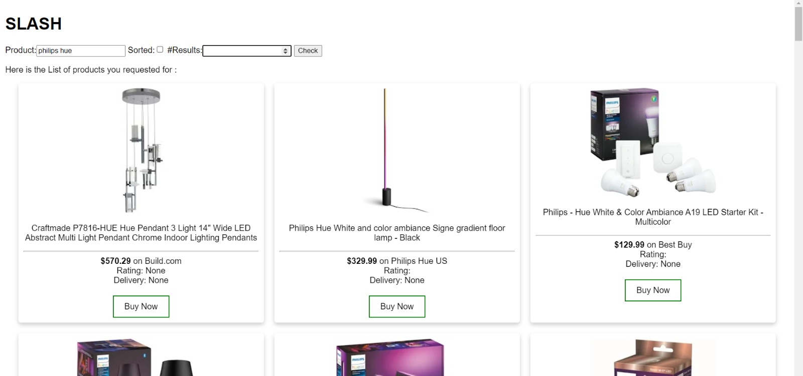

<p align="center"></p>

**Shopping Made Easy**

[](https://github.com/aadiltajani/slash/blob/main/LICENSE)
[](https://github.com/aadiltajani/slash/actions)
[](https://zenodo.org/badge/latestdoi/561915312)

[](https://github.com/aadiltajani/slash/issues?q=is%3Aopen+is%3Aissue)
[](https://github.com/aadiltajani/slash/issues?q=is%3Aissue+is%3Aclosed)
[](https://github.com/aadiltajani/slash/pulls)
[](https://codecov.io/github/aadiltajani/slash)

[](https://www.python.org/download/releases/3.0/)
[](https://www.jetbrains.com/idea/)
[](https://www.gnu.org/software/bash/)

Slash is a Web interface that scrapes the most popular e-commerce websites to get the best deals on the searched items across these websites. 
- **Fast**: With slash, you can save over 50% of your time by comparing deals across websites within seconds
- **Easy**: Slash uses very easy commands to filter, sort and search your items
- **Powerful**: Quickly alter the commands to get desired results
- **Informative**: Provides the information about items through an email with attached csv file

:open_file_folder: Document Generated
---
To have a better understanding of the code, please click on the [link](https://aadiltajani.github.io/slash/) provided below.

[Github Pages Document](https://aadiltajani.github.io/slash/)


<ul align="left">
  <li> <a href="#rocket-installation">Installation</a> </li>
 
  <li><a href="#card_index_dividers-some-examples">Examples</a></li>
  
  <li> <a href="#modified-workflow-and-scalability">Modified Workflow and Scalability</a> </li>
  
  <li><a href="#thought_balloon-use-case">Use Case</a></li>
  
  <li><a href="#page_facing_up-why">Why</a></li>
  
  <li><a href="#sparkles-contributors">Contributors</a></li>
  
  <li><a href="#email-support">Support</a></li>
  
</ul>

# Original Implementation:

---

<p align="center"></p>

---

# Our Modification:

---

<p align="center"></p>

---

:rocket: Installation
---
1. Clone the Github repository to a desired location on your computer. You will need [git](https://git-scm.com/) to be preinstalled on your machine. Once the repository is cloned, you will then ```cd``` into the local repository.
```
git clone https://github.com/aadiltajani/slash
cd slash
```
2. This project uses Python 3, so make sure that [Python](https://www.python.org/downloads/) and [Pip](https://pip.pypa.io/en/stable/installation/) are preinstalled. All requirements of the project are listed in the ```requirements.txt``` file. Use pip to install all of those.
```
pip3 install -r requirements.txt
```
3. Once all the requirements are installed, you will have to ```cd``` into the ```src``` folder. Once in the ```src``` folder, ```cd``` into the ```web``` folder use the python command to run the ```app.py``` file. It will start the website on your localhost at port 5000 and you can start searching.


# Modified Workflow and Scalability:

We are now fetching the results from a single source with more than 1000 stores and better caching and result maaching and not just 3 stores as in the original implementation (Amazon, Target, Walmart). The tests show the number of sellers selling that particular searched item and if all the departments are considered, there are over more than 1000 sellers from our source (Google).
We are fetching the results in a significantly shorter period of time. 

Earlier time for fetching results: 22 seconds, 45ms
New time for fetching results: 2 seconds, 02ms which is visible on running the tests and could be even faster if images are not collected. This has led to 12x faster execution with 3x more simpler implementation.

We have also implemented a UI from where all the products are easily viewable and accessible. 
We can also redirect to the stores from where they can buy the products. 

A few snapshots of our UI:

<p align="center"></p>
<p align="center"></p>


:thought_balloon: Use Case
---
* ***Students***: Students coming to university are generally on a budget and time constraint and generally spend hours wasting time to search for products on Websites. Slash is the perfect tool for these students that slashes all the unnecessary details on a website and helps them get prices for a product across multiple websites.Make the most of this tool in the upcoming Black Friday Sale.
* ***Data Analysts***: Finding data for any project is one of the most tedious job for a data analyst, and the datasets found might not be the most recent one. Using slash, they can create their own dataset in real time and format it as per their needs so that they can focus on what is actually inportant.
* ***Customers***: Can be used by customers to simply query for the items and get a email on the details.

:page_facing_up: Why
---
- In a market where we are spoilt for choices, we often look for the best deals.  
- The ubiquity of internet access has leveled the retail playing field, making it easy for individuals and businesses to sell products without geographic limitation. In 2020, U.S. e-commerce sales, receiving a boost due to the COVID-19 pandemic, grew 44% and represented more than 21% of total retail sales, according to e-commerce information source Internet Retailer.
- The growth of e-commerce has not only changed the way customers shop, but also their expectations of how brands approach customer service, personalize communications, and provide customers choices.
- E-commerce market has prompted cut throat competition amongst dealers, which is discernable through the price patterns for products of major market players. Price cuts are somewhat of a norm now and getting the best deal for your money can sometimes be a hassle (even while online shopping).
- This is what Slash aims to reduce by giving you an easy to use, all in one place solution for finding the best deals for your products that major market dealers have to offer!
- Slash in its current form is for people who have some understanding of python and are comfortable in using the command line interface to interact with systems.
- Future updates aim to encompass a wide variety of users irrespective of their computer knowledge and background.


:sparkles: Contributors
---

<table>
  <tr>
    <td align="center"><a href="https://github.com/aadiltajani">Aadil Tajani</a></td>
    <td align="center"><a href="https://github.com/asingh0404">Aastha Singh</a></td>
    <td align="center"><a href="https://github.com/ArpitCh21">Arpit Choudhary</a></td>
    <td align="center"><a href="https://github.com/Dhruvish-Patel">Dhruvish Patel</a></td>
    <td align="center"><a href="https://github.com/KaustubhKael">Kaustubh Deshpande</a></td>
  </tr>
</table>

:email: Support
---

For any queries and help, please reach out to us at: 

Dhruvish Patel: [Email](mailto:dhruvishpatel02@gmail.com)

Aadil Tajani: [Email](mailto:tajani.aadil@gmail.com)

